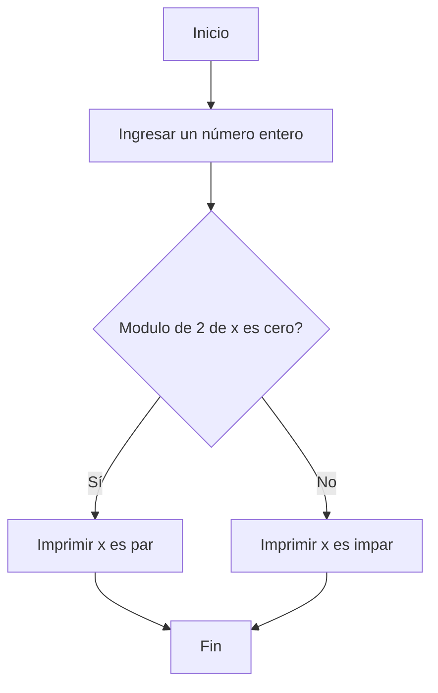
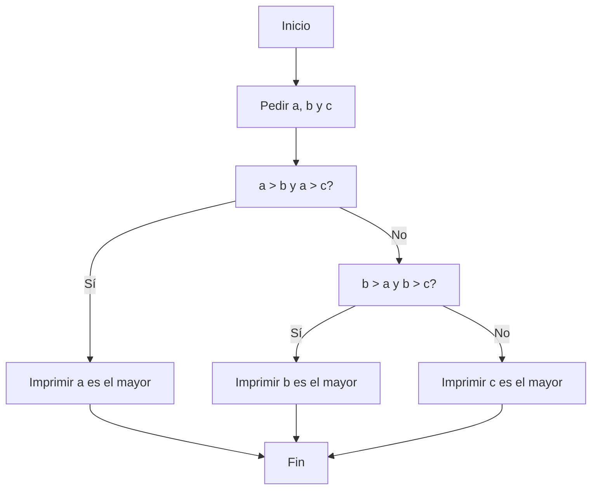

# TALLER 1, PYTH-OHM
### 1.Quiz
[](https://postimg.cc/rDs5cmkW)

###  2.Programa que lea tres números reales y determine cuál es el mayor.
```
# Punto 2 del taller 1:
# Realice un programa que lea 
# tres números reales y determine cuál es el mayor.
a=float
b=float
c=float
a = input("digite un primer numero : ")
b = input("digite otro numero : ")
c = input("digite un ultimo numero : ")
if a>b and a>c :
    print(a, " es el numero mayor.")
elif b>a and b>c :
    print(b, " es el numero mayor.")
elif c>a and c>b :
    print( c, " es el numero mayor.")
```

En este codigo el numero "a" se compara con los numeros anteriores, si se da que este numero es mayor que los otros, se imprime que "a" es el numero mayor, sino sigue con el otro numero hasta encontrar el numero mayor

Por el numero de documento se realizo el diagrame de flujo de este codigo:


###  3.Programa que lea un número entero y determine si es par o impar.
```
x=int(input("ingrese un numero entero: "))
if x % 2 == 0:
  print(x, "es par")
else:
  print(x, "es impar")
```
En este codigo se revisa si el modulo del numero ingresado entre 2, es 0 o no, si es 0 significa que el numero es par, ya que todos los numeros pares al dividirlos entre 2 dan un residuo de cero y impreme que el numero es par, si el modulo no es cero el numero es impar.  

### 4.Programa que lea dos números reales y determine si el primero es múltiplo del segundo.
```
n=float(input("digite un numero real : "))
m=float(input("digite otro numero real : "))
if m%n==0:
    print(n," es multiplo de ",m)
else:
    print(n," no es multiplo de ",m)
```    
En este codigo se usan condicionales y se evalua si el modulo del segundo numero "m" entre el primero "n" es 0, ya que si esto se cumple "n" es multiplo de "m", entonces al ser cero imprime que "n, es multiplo de m",  y si no es cero imprime que "n, no es multiplo de m"

Por el ultimo numero de documento se hizo diagrama de flujo del punto 4: 

### 5.Realice un programa que lea tres números reales y determine si la suma de los dos primeros es mayor, menor o igual que el tercer número.
```
x=float(input("ingrese el primer numero: "))
y=float(input("ingrese el segundo numero: "))
z=float(input("ingrese el tercer numero: "))
if x+y > z:
    print("la suma de " +str(x)+ " y " +str(y)+ " es mayor que " +str(z) )
elif x+y < z:
    print("la suma de " +str(x)+ " y " +str(y)+ " es menor que " +str(z) )
else:
    print("la suma de " +str(x)+ " y " +str(y)+ " es igual a " +str(z) )
```
En este codigo se compara si la suma de los dos primeros numeros "x" y "y" es mayor, menor o igual al tercer numero, usando solo los condicionales, "if", "elif" y "else"  por medio de las siguientes formulas:
si se cumple esta formula, se imprime que la suma de los dos primeros numeros es mayor que z
##### x+y>z
si se cumple esta formula, se imprime que la suma es menor
##### x+y<z

si no se cumple ninguna de las anteriores, se imprime que la suma es igual al tercer numero
##### x+y=z


### 6.Escriba un programa que solicite al usuario una letra y determine si es una vocal o una consonante.
```
x=str(input("ingrese una letra en minusculas"))
if x == str("a") or x == str("e") or x == str("i") or x == str("o") or x == str("u"):
    print("Es una vocal")
elif x== str("b") or x == str("c") or x == str("d") or x == str("f") or x == str("g") or x == str("h") or x == str("j")or x == str("k")or x == str("l") or x == str("m") or x == str("n")or x == str("p") or x == str("q") or x == str("r") or x == str("s") or x == str("t") or  x == str("v") or x == str("w") or x == str("x") or x == str("y") or x == str("z") :
    print("Es una consonante")
else:
    print("no es una consonante o no la escribiste en minuscula")
```
En este codigo se usan condicionales, tal que al digitar una vocal minuscula imprime que es una vocal, al digitar una consonante, imprime que es una consonante y si no es ninguna de las dos, imprime que no es una consonante

### 7. Escriba un programa que pida 5 números reales y calcule las siguientes operaciones:
El promedio,
La mediana,
El promedio multiplicativo (multilplica todos y luego calcula la raíz de la cantidad de operandos),
Ordenar los números de forma ascendente,
Ordenar los números de forma descendente,
La potencia del mayor número elevado al menor número,
La raíz cúbica del menor número.
``` 
 a=float(input("Escribe el primer numero: "))
b=float(input("Escribe el segundo numero: "))
c=float(input("Escribe el tercer numero: "))
d=float(input("Escribe el cuarto numero: "))
e=float(input("Escribe el quinto numero: "))
m1=float
m2=float
m3=float
m4=float
m5=float

#ordenar el primer numero
if a<b and a<c and a<d and a<e:
    m1=a
else:
    if a>b and a<c and a<d and a<e:
        m2=a
    if a>b and a>c and a<d and a<e:
        m3=a
    if a>b and a<c and a>d and a<e:
        m3=a
    if a>b and a<c and a<d and a>e:
        m3=a
    if a<b and a>c and a>d and a<e:
        m3=a
    if a<b and a>c and a<d and a>e:
        m3=a
    if a<b and a<c and a>d and a>e:
        m3=a
    if a<b and a>c and a<d and a<e:
        m2=a 
    if a<b and a<c and a>d and a<e:
        m2=a
    if a<b and a<c and a<d and a>e:
        m2=a
    if a>b and a>c and a>d and a<e:
        m4=a
    if a>b and a<c and a>d and a>e:
        m4=a
    if a>b and a>c and a<d and a>e:
        m4=a
    if a<b and a>c and a>d and a>e:
        m4=a
    if a>b and a>c and a>d and a>e:
        m5=a
#ordenar el segundo numero
if b<a and b<c and b<d and b<e:
    m1=b 
else:
    if b>a and b<c and b<d and b<e:
        m2=b
    if b>a and b>c and b<d and b<e:
        m3=b
    if b>a and b<c and b>d and b<e:
        m3=b
    if b>a and b<c and b<d and b>e:
        m3=b
    if b<a and b>c and b>d and b<e:
        m3=b
    if b<a and b>c and b<d and b>e:
        m3=b
    if b<a and b<c and b>d and b>e:
        m3=b
    if b<a and b>c and b<d and b<e:
        m2=b
    if b<a and b<c and b>d and b<e:
        m2=b
    if b<a and b<c and b<d and b>e:
        m2=b
    if b>a and b>c and b>d and b<e:
        m4=b
    if b>a and b<c and b>d and b>e:
        m4=b
    if b>a and b>c and b<d and b>e:
        m4=b
    if b<a and b>c and b>d and b>e:
        m4=b
    if b>a and b>c and b>d and b>e:
        m5=b
#ordenar el tercer numero
if c<a and c<b and c<d and c<e:
    m1=c
else:
    if c>a and c<b and c<d and c<e:
        m2=c
    if c<a and c>b and c<d and c<e:
        m2=c
    if c<a and c<b and c>d and c<e:
        m2=c
    if c<a and c<b and c<d and c>e:
        m2=c
    if c>a and c>b and c<d and c<e:
        m3=c
    if c>a and c<b and c>d and c<e:
        m3=c
    if c>a and c<b and c<d and c>e:
        m3=c
    if c<a and c>b and c>d and c<e:
        m3=c
    if c<a and c>b and c<d and c>e:
        m3=c
    if c<a and c<b and c>d and c>e:
        m3=c
    if c>a and c>b and c>d and c<e:
        m4=c
    if c>a and c<b and c>d and c>e:
        m4=c
    if c>a and c>b and c<d and c>e:
        m4=c
    if c<a and c>b and c>d and c>e:
        m4=c
    if c>a and c>b and c>e and c>d:
        m5=c
#ordenar el cuarto numero
if d<a and d<b and d<c and d<e:
    m1=d
else:
    if d>a and d<b and d<c and d<e:
        m2=d
    if d<a and d>b and d<c and d<e:
        m2=d
    if d<a and d<b and d>c and d<e:
        m2=d
    if d<a and d<b and d<c and d>e:
        m2=d
    if d>a and d>b and d<c and d<e:
        m3=d
    if d>a and d<b and d>c and d<e:
        m3=d
    if d>a and d<b and d<c and d>e:
        m3=d
    if d<a and d>b and d>c and d<e:
        m3=d
    if d<a and d>b and d<c and d>e:
        m3=d
    if d<a and d<b and d>c and d>e:
        m3=d
    if d>a and d>b and d>c and d<e:
        m4=d
    if d>a and d<b and d>c and d>e:
        m4=d
    if d>a and d>b and d<c and d>e:
        m4=d
    if d<a and d>b and d>c and d>e:
        m4=d
    if d>a and d>b and d>c and d>e:
        m5=d
#Ordenar el quinto numero
if e<b and e<c and e<d and e<a:
    m1=e
else:
    if e>b and e<c and e<d and e<a:
        m2=e
    if e>b and e>c and e<d and e<a:
        m3=e
    if e>b and e<c and e>d and e<a:
        m3=e
    if e>b and e<c and e<d and e>a:
        m3=e
    if e<b and e>c and e>d and e<a:
        m3=e
    if e<b and e>c and e<d and e>a:
        m3=e
    if e<b and e<c and e>d and e>a:
        m3=e
    if e<b and e>c and e<d and e<a:
        m2=e 
    if e<b and e<c and e>d and e<a:
        m2=e
    if e<b and e<c and e<d and e>a:
        m2=e
    if e>b and e>c and e>d and e<a:
        m4=e
    if e>b and e<c and e>d and e>a:
        m4=e
    if e>b and e>c and e<d and e>a:
        m4=e
    if e<b and e>c and e>d and e>a:
        m4=e
    if e>a and e>b and e>c and e>d:
        m5=e
print("el promedio de los numeros dados es: " + str((m1)+(m2)+(m3)+(m4)+(m5)/5))
print("La mediana de los numeros suministrados es: " +str(m3))
print("El promedio multiplicativo es: " + str((m1*m2*m3*m4*m5)**(1/5)))
print("Los numeros ordenados de forma descendente serian: "+str(m1)+ ", " +str(m2)+ ", " +str(m3)+ ", " +str(m4)+ ", " +str(m5))
print("Los numeros ordenados de forma ascendente serian: "+str(m5)+ ", " +str(m4)+ ", " +str(m3)+ ", " +str(m2)+ ", " +str(m1))
print("El numero mayor elevado al numero menor es:" +str(m5**m1))
print("la raiz del numero menor es: " +str(m1**0.5))
```
En este codigo lo primero que se hace es ordenar los numeros de la siguiente forma:
###### si el numero es el menor de los cinco numeros se llamara: m1
###### si el numero es mayor que exactamente dos de los cinco numeros se llamara: m2
###### si el numero es mayor que exactamente tres de los cinco numeros se llamara: m3
###### si el numero es mayor que exactamente cuatro de los cinco numeros se llamara: m4
###### si el numero es mayor que todos los demas numeros, se llamara:m5
###### para hallar el promedio se suman m1, m2, m3, m4 y m5 y luego estos se dividen por la cantidad todal que seria 5
###### Para hallar la mediana solo se imprime el valor m3, ya que al ordenar los valores m3 seria el valor intermedio, de los numeros ya ordenados
###### para hallar el promedio multiplicativo, se multiplica, m1, m2, m3, m4 y m5 y a estos se les saca la raiz de 5, que es la cantidad total de valores
###### para ordenarlos de menor a mayor se imprime m1, m2, m3, m4 y m5, en ese orden ya que se les asigno esos valores de menor a mayor
para ordenarlos de mayor a menor se imprime m5, m4, m3, m2 y m1, en ese orden, que seria imprimirlos en el orden que se les asigno pero alreves.
Para hallar el numero mayor elevado al menor numero seria elevar m1 a m5 
Para hallar la raiz del numero menor se eleva 0.5 al m1

### 8.Escriba un programa al que se le ingrese la frecuencia de una onda en hz y como salida arroje en que parte del espectro electromagnético se encuentra.
```
frecuencia = float(input("Ingrese la frecuencia (hz): "))
if frecuencia <= 30*10**3 :
  print("Muy Baja Frecuencia")
elif frecuencia > 30*10**3 and frecuencia <= 650*10**3:
  print("Onda Larga - Radio")
elif frecuencia > 650*10**3 and frecuencia <= 1.7*10**6:
  print("Onda media - Radio")
elif frecuencia >1.7*10**6  and frecuencia <=30*10**6:
  print("Onda Corta - Radio")
elif frecuencia > 30*10**6  and frecuencia <= 300*10**6:
  print("Muy Alta Frecuencia-Radio")
elif frecuencia >300*10**6  and frecuencia <= 3*10**8:
  print("Ultra Alta Frecuencia-Radio")
elif frecuencia >3*10**8  and frecuencia <= 300*10**9 :
  print("Microondas")
elif frecuencia > 300*10**9 and frecuencia <= 6.00*10**12:
  print("Infrarrojo lejano/submilimétrico")
elif frecuencia > 6.00*10**12 and frecuencia <= 120*10**12:
  print("Infrarrojo medio")
elif frecuencia >  120*10**12 and frecuencia <= 384*10**12:
  print("Infrarrojo cercano")
elif frecuencia >  384*10**12 and frecuencia <= 7.89*10**14 :
  print("Espectro Visible")
elif frecuencia >  7.89*10**14 and frecuencia <= 1.5*10**15:
  print("Ultravioleta cercano")
elif frecuencia > 1.5*10**15  and frecuencia <= 30.0*10**15 :
  print("Ultravioleta extremo")
elif frecuencia >   30.0*10**15  and frecuencia <= 30.0*10**18 :
  print("Rayos X")
else:
  print("Rayos gamma")
  ```
##### Para el codigo se usa la siguiente clasificacion:
###### Muy baja frecuencia (0 - 30 kHz)
###### Onda Larga - Radio (30 kHz - 650 kHz)
###### Onda Media - Radio (650 kHz - 1.7 MHz)
###### Onda Corta - Radio (1.7 MHz - 30 MHz)
###### Muy Alta Frecuencia - Radio (30 MHz - 300 MHz)
###### Ultra Alta Frecuencia - Radio (300 MHz - 3 GHz)
###### Microondas (3 GHz - 300 GHz)
###### Infrarrojo lejano/submilimétrico (300 GHz - 6 THz)
###### Infrarrojo medio (6 THz - 120 THz)
###### Infrarrojo cercano (120 THz - 384 THz)
###### Espectro visible (384 THz - 789 THz)
###### Ultravioleta cercano (789 THz - 1.5 PHz)
###### Ultravioleta extremo (1.5 PHz - 30 PHz)
###### Rayos X (30 PHz - 30 EHz)
######VRayos gamma (> 30 EHz)
en donde se usan condicionales y intarvalos para clasificarlos y imprimir  a que parte del espectro electromagnetico pertenecen los Hz que introduce el usuario.
  ### 9. Escriba un programa que reciba el nombre en minúsculas de un país de America y retorne la ciudad capital, si el país no pertenece al continente debe arrojar país no identificado.
```
  x=str(input("ingrese un pais de America en minusculas"))
#america del norte
if x == str("canada"):
    print("otawwa")
elif x== str("estados unidos"):
    print("washington dc")
elif x== str("mexico"):
    print("ciudad de mexico")
#america central
elif x== str("belice"):
    print("belmopan")
elif x== str("costa rica"):
    print("san jose")
elif x== str("el salvador"):
    print("san salvador")
elif x== str("guatemala"):
    print("ciudad de guatemala")
elif x== str("honduras"):
    print("tegucigalpa")
elif x== str("nicaragua"):
    print("managua")
elif x== str("panama"):
    print("panama")
#america del sur
elif x== str("argentina"):
    print("buenos aires")
elif x== str("bolivia"):
    print("sucre")
elif x== str("brasil"):
    print("brasilia")
elif x== str("chile"):
    print("santiago de chile")
elif x== str("colombia"):
    print("bogota")
elif x== str("ecuador"):
    print("quito")
elif x== str("paraguay"):
    print("asuncion")
elif x== str("peru"):
    print("lima")
elif x== str("surinam"):
    print("parabarimo")
elif x== str("trinidad y tobago"):
    print("puerto españa")
elif x== str("uruguay"):
    print("montevideo")
elif x== str("venezuela"):
    print("caracas")
#Las santillas
elif x== str("antigua y barbuda"):
    print("saint john")
elif x== str("bahamas"):
    print("nasau")
elif x== str("barbados"):
    print("bridgetown")
elif x== str("cuba"):
    print("la habana")
elif x== str("dominica"):
    print("roseau")
elif x== str("granada"):
    print("georgetown")
elif x== str("haiti"):
    print("puerto principe")
elif x== str("jamaica"):
    print("kingston")
elif x== str("republica dominicana"):
    print("santo domingo")
elif x== str("san cristobal y nieves"):
    print("basseterre")
elif x== str("san vicente y las granadinas"):
    print("kingstown")
elif x== str("santa lucia"):
    print("castries")
else:
    print("Pais no identificado, o no digitaste el pais en minusculas")
  ```
En este codigo se digitaron todos los paises de america en minuscula, y por medio de condicionales "if", "elif" y "else", segun el pais de America que se digit<e se imprimira como respuesta su capital, si el pais no pertenece a america o no se escribe en minuscula se imprime: "Pais no identificado, o no digitaste el pais en minusculas""

### Escriba un programa que dada una distancia calcule:

El tiempo que le tomaría a la luz recorrer la distancia.
El tiempo que le tomaría al sonido (en el aire) recorrer la distancia.
El tiempo que le tomaría al vehiculo comercial más veloz recorrer la distancia.
El tiempo que le tomaría a Bolt recorrer la distancia.
```
x= float(input("escriba una distacia en km"))
y= float(299792.458)
a= float(1235)
b= float(508)
c= float(44.72)

luz= (x/y)/60
sonido= (x/a)
auto=(x/b)
bolt=(x/c)

print("La luz llegara en" ,str(luz)+  " minutos \n" + "El sonido a una temperatura de 20 grados tardara " + str(sonido)+  " horas \n"+ "El SSC Tautuara tardara " + str(auto)+  " horas en recorrer la distancia \n" + "Bolt tardaria " + str(bolt)+  " horas en recorrer la distacia \n")
 ```
 En este codigo se digitan como variables "y", "a", "b", "c", las velocidades de la luz, del sonido, del auto mas rapido del mundo, y de bolt respectivamente, y como "x" la velocidad que el usario digita en Km, dividiendo esa distancia "x" entre las velocidades se puede calcular la velocidad que se tardaria cada uno en recorrer la distancia, ademas se divide la velocidad de la luz entre 60 para para poder dar el tiempo que tarda en minutos, despues de los calculos se imprime el tiempo que tomaria cada una de las velocidades en recorrer la distancia que se digito.
 ```mermaid
 graph TD
A[Inicio] --> B[Ingresar una distancia en km]
 C[Distancia dividido en 299792.458 y luego dividirlo en 60]
C--> D[Imprimir tiempo de llegada de la luz en minutos]
 E[Distancia dividio en 1235]
E-->F[Imprimir tiempo de llegada del sonido en horas]
 G[Distancia dividio 508]
G--> H[Imprimir tiempo de llegada del SSC Tuatara en horas]
 I[Distancia dividido 44.72]
I--> J[Imprimir tiempo de llegada de Bolt en horas]
J --> K[Fin]
B-->C 
B-->E
B-->G 
B-->I 
D-->K; F-->K; H-->K
 ```